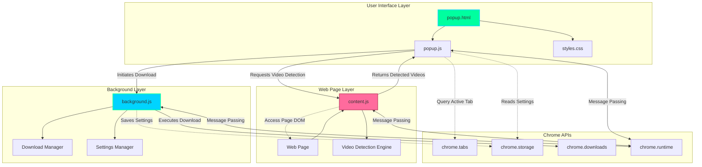
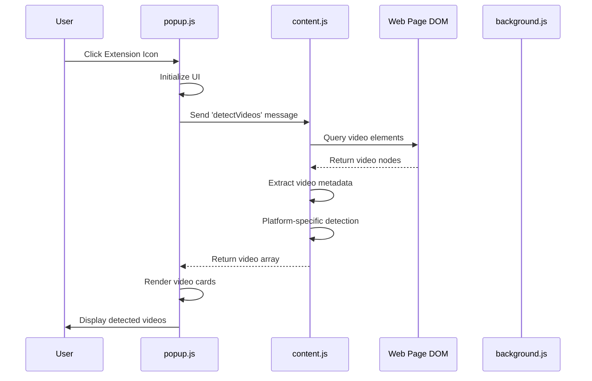
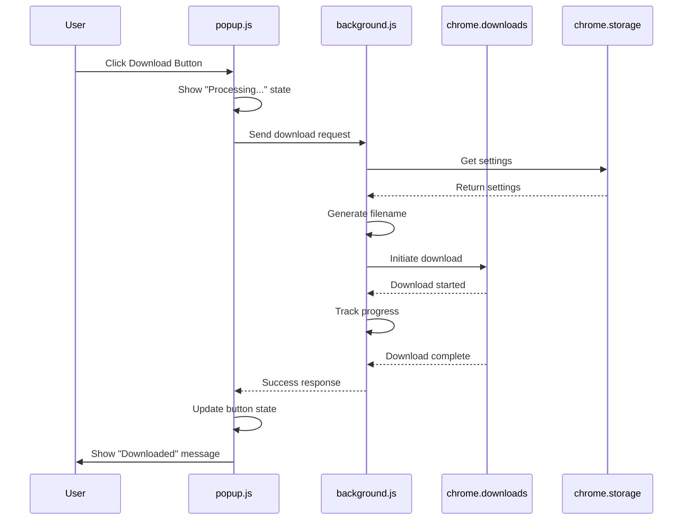
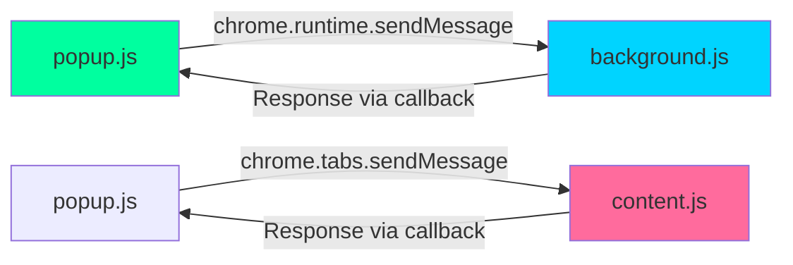
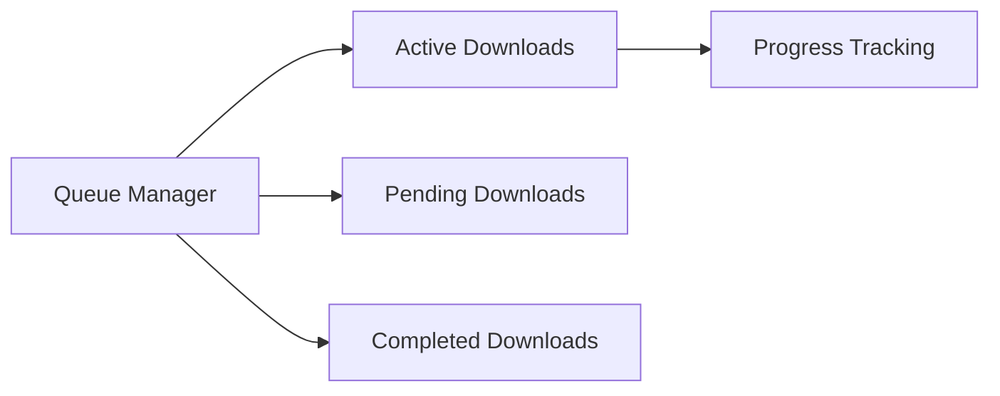

#  Video Downloader Pro - System Architecture

This document provides a comprehensive technical overview of the Video Downloader Pro Chrome extension architecture, component interactions, and data flow.

## System Overview

Video Downloader Pro is a Chrome Manifest V3 extension that uses a multi-component architecture:

1. **Popup Interface** - User-facing UI
2. **Content Scripts** - Page video detection
3. **Background Service Worker** - Download orchestration
4. **Chrome APIs** - System integration

##  Architecture Diagram



##  Data Flow

### 1. Video Detection Flow



### 2. Download Flow



##  Component Details

### 1. Popup (UI Layer)

**Files**: `popup.html`, `popup.js`, `styles.css`

**Responsibilities**:
- Display detected videos
- Handle user interactions
- Quality selection interface
- Download initiation
- Status updates

**Key Functions**:
```javascript
class VideoDownloaderUI {
  async detectVideos()      // Request video detection
  renderVideoCards(videos)  // Render video UI
  downloadVideo(video)      // Initiate download
  updateStatus(text)        // Update status badge
}
```

**UI Components**:
- Header with logo and status badge
- Video cards with thumbnails
- Quality selector buttons
- Download buttons with states
- Footer with statistics

### 2. Content Script (Detection Layer)

**File**: `content.js`

**Responsibilities**:
- Detect videos on web pages
- Extract video metadata
- Platform-specific detection logic
- Thumbnail extraction

**Key Functions**:
```javascript
class VideoDetector {
  detectPlatform()           // Identify current platform
  detectVideos()             // Main detection orchestrator
  detectYouTubeVideos()      // YouTube-specific detection
  detectTwitterVideos()      // Twitter-specific detection
  extractThumbnail(video)    // Extract video thumbnail
}
```

**Detection Strategies**:

| Platform | Detection Method | Metadata Sources |
|----------|------------------|------------------|
| YouTube | URL parsing, DOM selectors | Video ID, title element, duration display |
| Twitter | Video element search | Tweet container, video src |
| Instagram | Video element search | Container attributes, video src |
| Generic | Standard `<video>` tags | Native video properties |

### 3. Background Service Worker (Orchestration Layer)

**File**: `background.js`

**Responsibilities**:
- Download management
- Settings persistence
- Context menu integration
- Badge updates

**Key Functions**:
```javascript
async function handleDownload(video, quality)  // Process downloads
function generateFilename(video, quality)      // Create filenames
// Event listeners for installation, messages, context menus
```

**Download Process**:
1. Receive download request from popup
2. Retrieve user settings from storage
3. Generate filename from template
4. Validate video URL
5. Initiate Chrome download
6. Track download progress
7. Report status back to popup

## Chrome API Integration

### Message Passing Architecture



### API Usage Summary

| API | Purpose | Used In |
|-----|---------|---------|
| `chrome.tabs` | Query active tab, inject scripts | popup.js |
| `chrome.runtime` | Message passing between components | All files |
| `chrome.storage` | Persist user settings | popup.js, background.js |
| `chrome.downloads` | Download video files | background.js |
| `chrome.scripting` | Inject content script dynamically | popup.js |
| `chrome.contextMenus` | Right-click menu integration | background.js |

## Data Models

### Video Object Structure

```javascript
{
  id: string,              // Unique identifier
  platform: string,        // "YouTube" | "Twitter" | "Instagram" | etc.
  url: string,            // Page URL
  sourceUrl: string,      // Direct video URL
  title: string,          // Video title
  thumbnail: string,      // Thumbnail URL or data URI
  duration: string,       // Formatted duration "MM:SS"
  qualities: string[],    // Available qualities ["720p", "1080p"]
}
```

### Settings Object Structure

```javascript
{
  defaultQuality: string,        // "1080p"
  autoDownload: boolean,         // false
  filenameTemplate: string,      // "{platform}_{title}_{quality}"
  downloadPath: string,          // Custom download path
}
```

## UI/UX Design Principles

### Design System

**Color Palette**:
- Primary Background: `#0a0a0f` (Deep Dark)
- Secondary Background: `#141420` (Dark Purple)
- Accent Primary: `#00ff9f` (Neon Green)
- Accent Secondary: `#00d4ff` (Cyan)
- Gradient: `linear-gradient(135deg, #00ff9f 0%, #00d4ff 100%)`

**Typography**:
- Display Font: `Syne` (Modern, Bold)
- Monospace Font: `IBM Plex Mono` (Code, Stats)

**Animations**:
- Slide-in for video cards (0.4s ease-out)
- Pulse for logo (2s infinite)
- Shimmer for header line (3s infinite)
- Button hover effects with ripple

### Responsive States

1. **Empty State**: No videos detected
2. **Loading State**: Scanning for videos
3. **Active State**: Videos found and displayed
4. **Downloading State**: Download in progress
5. **Success State**: Download completed
6. **Error State**: Download failed

## Security Considerations

### Content Security

1. **CORS Handling**: Thumbnail extraction may fail due to CORS
2. **XSS Prevention**: All user-generated content is escaped via `escapeHtml()`
3. **URL Validation**: Video URLs are validated before download
4. **Permissions**: Minimal required permissions (activeTab, storage, downloads)

### Privacy

- No external analytics or tracking
- Settings stored locally in Chrome storage
- No video data sent to external servers
- No user data collection

## Performance Optimizations

### Detection Performance

- **Lazy Loading**: Content script loads only on supported domains
- **Debouncing**: Video detection debounced to avoid excessive DOM queries
- **Caching**: Detected videos cached in popup for session duration

### UI Performance

- **CSS Animations**: Hardware-accelerated transforms
- **Virtual Scrolling**: Planned for large video lists
- **Lazy Thumbnail Loading**: Thumbnails load on-demand

##  Scalability

### Current Limitations

- **Concurrent Downloads**: Limited by browser download manager
- **Video List Size**: UI may slow with 100+ videos (rare)
- **Memory**: Thumbnail caching uses browser memory

### Future Improvements

1. **Worker Threads**: Move detection to Web Workers
2. **IndexedDB**: Store download history and metadata
3. **Batch Processing**: Queue management for multiple downloads
4. **Streaming**: Support for large file downloads


## Extension Manifest (v3)

```json
{
  "manifest_version": 3,
  "permissions": ["activeTab", "storage", "downloads", "webRequest"],
  "background": {
    "service_worker": "background.js"
  },
  "content_scripts": [{
    "matches": ["https://*.youtube.com/*", ...],
    "js": ["content.js"],
    "run_at": "document_idle"
  }]
}
```

**Key Manifest V3 Changes**:
- Service Worker instead of background page
- `host_permissions` for cross-origin requests
- Scripting API for dynamic injection

## Future Architecture Enhancements

### Planned Features

1. **Download Queue System**


2. **Plugin System** for additional platforms
3. **Cloud Sync** for settings across devices
4. **Video Conversion** pipeline
5. **Subtitle Extraction** module

## Developer Guide

### Adding a New Platform

1. **Update manifest.json**:
   - Add domain to `host_permissions`
   - Add domain to `content_scripts` matches

2. **Extend VideoDetector class**:
   ```javascript
   detectNewPlatformVideos() {
     // Platform-specific detection logic
   }
   ```

3. **Update detectPlatform() method**

4. **Test detection and download**

### Modifying UI

1. **Update styles.css** for visual changes
2. **Modify popup.html** for structure changes
3. **Update VideoDownloaderUI class** for logic changes
4. **Test responsiveness and animations**


**Last Updated**: March 6, 2026  
**Architecture Version**: 1.0.0  
**Designed for**: Chrome Extension Manifest V3
